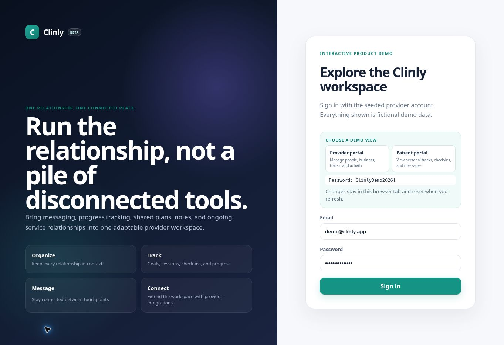
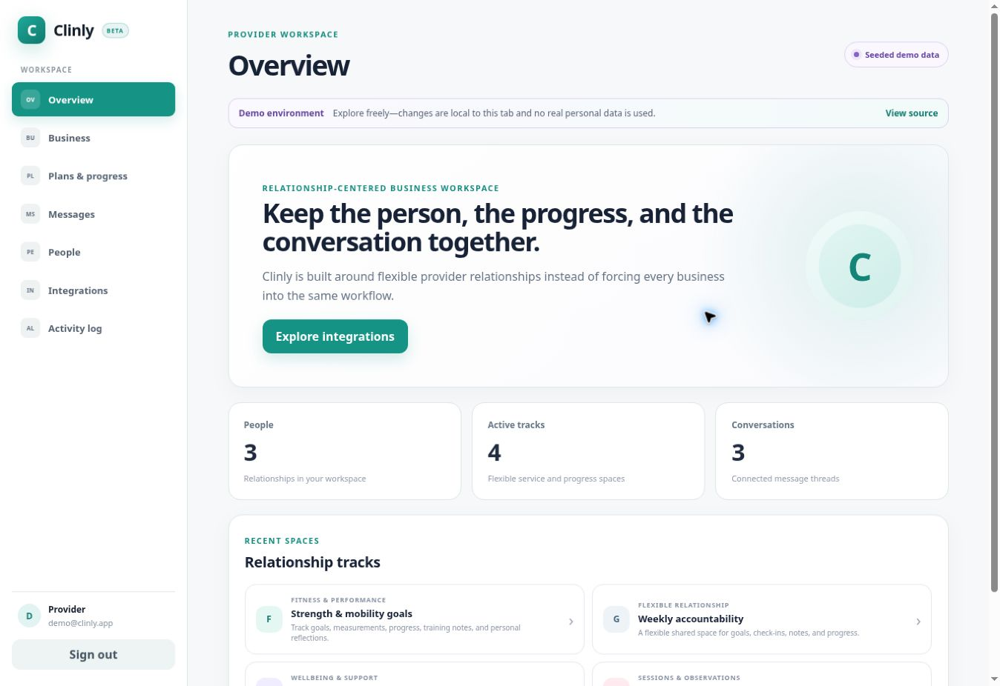
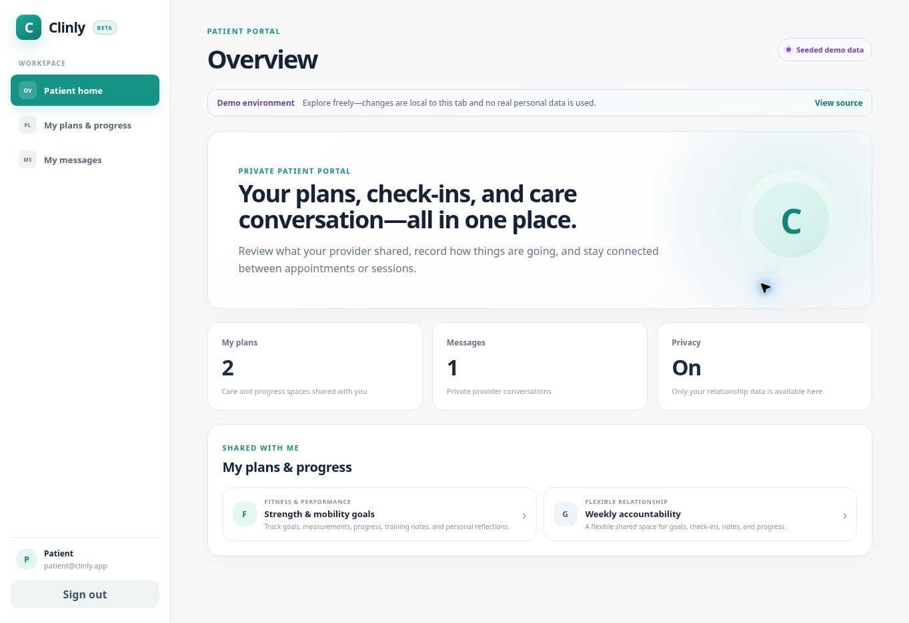

> [!IMPORTANT]
> **Proprietary software — copying prohibited.** This source is public for portfolio review and evaluation only. Copying, modification, redistribution, commercial use, rehosting, derivative works, and AI/ML training use are prohibited without prior written permission. See [LICENSE](LICENSE).

# Clinly

**BETA** · Secure provider and patient relationship portal with a React web app and FastAPI + MongoDB backbone.

**[Open the live demo](https://clinly-demo.netlify.app/)** · **[View the source](https://github.com/mergemaven11/clinly-backbone)**



## Live demo

The public Netlify deployment is a safe, browser-side product sandbox with seeded fictional data. It demonstrates both roles without requiring a paid API or database service.

| Portal | Email | Password | What it demonstrates |
|---|---|---|---|
| Provider | `demo@clinly.app` | `ClinlyDemo2026!` | People, business profile, services, plans, progress, messaging, integrations, and audit history |
| Patient | `patient@clinly.app` | `ClinlyDemo2026!` | Patient home, assigned plans, encrypted-style check-ins, progress history, and private provider messaging |

Demo changes stay inside the visitor's browser tab and reset on refresh. The hosted sandbox contains no real personal or health data and does not connect to the production FastAPI/MongoDB stack.

### Provider portal



### Patient portal



**Public product status: BETA · Current backend line: 1.0.x**

Clinly combines secure messaging with encrypted journaling and progress tracking for ongoing professional relationships. A participant can use the same private portal for care, fitness coaching, laser hair-removal progress, or a general relationship track without creating separate products for each use case.

> Clinly is designed to support strong security and privacy controls, but application code alone does not make an organization HIPAA compliant or satisfy the rules of every health, fitness, or personal-service use case. Administrative, contractual, operational, infrastructure, privacy, consent, and security controls remain the responsibility of the deploying organization.

## Full-stack V1 capabilities

### Relationship portal

- Professional and participant sign-in
- Dedicated provider workspace and patient portal navigation
- Professional-created participant accounts
- Participant roster scoped to the owning professional
- Care, Fitness, Laser Hair Removal, and General relationship tracks
- Encrypted track titles
- Encrypted journal/check-in payloads at rest
- Participant and professional access to shared track timelines
- Fitness goal, target, progress, and measurement check-ins
- Laser session date, treatment-area, redness, sensitivity, irritation, and journal observations
- Care/general mood, wellbeing, and journal check-ins
- Descriptive skin tracking only; Clinly does not diagnose skin conditions

### Secure communication and audit

- JWT Bearer authentication
- Tenant/relationship authorization before protected data is decrypted
- Therapist/professional-owned participant accounts
- Tenant-isolated conversations
- XChaCha20-Poly1305 authenticated encryption via PyNaCl
- Ciphertext-only message persistence
- Append-only application audit events
- Professional-scoped audit queries and CSV export
- Resource-safe denial behavior for foreign/guessed IDs
- Login failure throttling
- PHI-sensitive structured JSON request logging

### Engineering and operations

- React web frontend built with Vite
- Nginx static frontend with same-origin `/api` reverse proxy
- FastAPI backend
- MongoDB 7
- Docker Compose full-stack startup
- Codespaces/devcontainer configuration with ports 3000 and 8000 forwarded
- Python 3.11/3.12 integration and security tests
- Frontend dependency audit and production build in CI
- Locked Python dependency vulnerability audit
- Backend and frontend production image builds in CI

## Run the complete app

Requirements: Docker with Docker Compose.

```bash
cp .env.example .env
docker compose up --build
```

Open:

- **Clinly web app:** http://localhost:3000
- **FastAPI docs:** http://localhost:8000/docs
- **Health:** http://localhost:8000/health
- **Readiness:** http://localhost:8000/ready

The web container proxies `/api/*` to the FastAPI container, so the browser does not need a separate API hostname in the Compose stack.

The values in `.env.example` are development-only. Never reuse them in production.

## GitHub Codespaces

The repository includes `.devcontainer/devcontainer.json` with Docker-in-Docker, Node 22, Python 3.12, and forwarded ports for the web app and API.

Create a Codespace from the repository, then run:

```bash
docker compose up --build
```

Port **3000** is the user-facing Clinly portal. Port **8000** exposes the API and OpenAPI documentation.

## User flow

### Professional

1. Create a professional account or sign in.
2. Create a participant account.
3. Start one or more relationship tracks for that participant.
4. Add journal/progress entries or let the participant add their own check-ins.
5. Open a secure message thread.
6. Review the participant-scoped audit trail when needed.

### Participant

1. Sign in with the credentials created by the professional.
2. Open a shared relationship track.
3. Journal or enter progress/check-in information.
4. Review prior entries over time.
5. Use the secure conversation with the professional.

## Portal track types

| Track | Designed for | V1 check-ins |
|---|---|---|
| Care | patient/client and care relationships | journal, mood/theme, wellbeing rating |
| Fitness | coaching / fitness candidate | goals, targets, progress %, measurements, journal |
| Laser Hair Removal | treatment/customer relationship | session date, area, redness, sensitivity, irritation, journal |
| General | other ongoing relationships | flexible journal, mood/theme, wellbeing rating |

Track entry payloads and free-text track titles are encrypted before persistence. The database retains only the structural identifiers needed for authorization, ordering, and relationship lookup alongside ciphertext.

## API

Interactive OpenAPI documentation is available at `/docs` when enabled by the deployment.

Important endpoints include:

| Method | Path | Purpose |
|---|---|---|
| POST | `/auth/signup-therapist` | Create the current professional account type |
| POST | `/auth/login` | Authenticate and issue Bearer token |
| GET | `/auth/me` | Return authenticated user |
| POST | `/auth/create-client` | Professional creates an owned participant |
| GET | `/clients` | List owned participants |
| POST | `/portal/tracks` | Create a relationship track |
| GET | `/portal/tracks/me` | List accessible tracks |
| POST | `/portal/entries` | Add an encrypted journal/progress entry |
| GET | `/portal/entries` | List decrypted entries after authorization |
| POST | `/conversations` | Create a participant conversation |
| GET | `/conversations/me` | List accessible conversations |
| POST | `/messages` | Send encrypted message |
| GET | `/messages` | List authorized messages |
| GET | `/audit` | Query audit events for an owned participant |
| POST | `/export` | Export participant audit events as CSV |
| GET | `/health` | Process liveness |
| GET | `/ready` | MongoDB-aware readiness |

The database/API role name `THERAPIST` is retained in V1 for backward compatibility, while the web product presents that account as **Professional** because relationship tracks now support care, fitness, laser hair removal, and general use cases.

## Development

Backend:

```bash
poetry install
poetry run ruff check app tests
poetry run pytest -q
```

Frontend:

```bash
npm install --prefix web
npm run dev --prefix web
```

When using the Vite development server, `/api` is proxied to `http://localhost:8000`.

## Security model

Core rules:

- Do not log request bodies, passwords, tokens, decrypted messages, journal payloads, or other sensitive request content.
- Never persist message plaintext.
- Never persist portal free text or check-in payloads in plaintext.
- Authorize a participant/professional relationship before retrieving or decrypting portal data.
- Audit protected actions and authorization denials without putting journal/message content into audit metadata.
- Keep MongoDB authenticated, private, and TLS-protected in production.
- Inject secrets from an approved secrets manager.
- Treat `MESSAGE_ENCRYPTION_KEY` as recovery-critical. V1 does not implement key rotation/re-encryption.
- Skin-tracking fields are observational records, not diagnostic output.

See [SECURITY.md](SECURITY.md) for the backend security policy.

## Production and operations

- [Production configuration](docs/production-config.md)
- [Backup and restore operations](docs/operations.md)
- [V1 QA checklist](docs/qa-checklist.md)
- [Security policy](SECURITY.md)
- [Changelog](CHANGELOG.md)

## CI release gate

A candidate must pass:

- Ruff + pytest on Python 3.11
- Ruff + pytest on Python 3.12
- MongoDB-backed security/integration tests
- locked Python dependency audit
- frontend npm security audit
- frontend production build
- production API image build
- production web image build
- OpenAPI contract tests

Repository-level required-check enforcement is still tracked in GitHub issue #26.

## License / use

Review the repository's licensing and organizational policies before production use. Security, privacy, compliance, consent, and clinical/business review are required before handling real user data.
